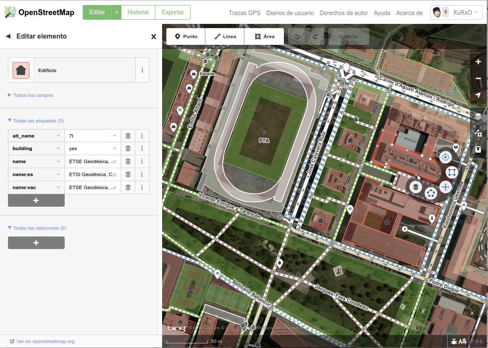

.. _introduccion:

======================================
Introducción: ¿Qué es OSM y el HOT?
======================================

.. contents:: Contenidos
   :depth: 3
   :backlinks: none

.. _intro-osm:

Introducción a OpenStreetMap
======================================

.. note:: Texto extraído de la `guía de inicio de OSM <http://learnosm.org/es/beginner/introduction/>`_

La información es poderosa. Con buena información y el correcto entendimiento,
los individuos y las comunidades son más capaces de mejorar sus vidas y tomar
buenas decisiones sobre el futuro. Hay muchas personas y organizaciones que
toman decisiones que afectan nuestras vidas. Buena información permite a estas
ONGs (organizaciones no gubernamentales), gobiernos y ciudadanos tomar mejores
decisiones, y con suerte nos hacen la vida mejor. Los mapas son una buena manera
de transmitir información.

    Un pueblo de Indonesia

Los mapas son símbolos visuales de nuestro mundo. A menudo puede demostrar una
idea mejor que las palabras. Esto a su vez puede ayudarnos a responder preguntas
importantes. *¿Dónde está la escuela u hospital más cercano? ¿Quién tiene menos
acceso a estas instalaciones? ¿Dónde está la pobreza más problemática?*
Preguntas como éstas pueden a menudo expresarse mejor con mapas, y los mapas
pueden ayudar a encontrar soluciones a estas preguntas.

Como ejercicio, consiga un bolígrafo y papel y dibuje un mapa de su ciudad o
pueblo. ¿Cuáles son las cosas más importantes para incluir en el mapa? ¿Cuál es
la información más importante? Dedique unos minutos a hacer su mapa, y cuando
haya terminado, piense por qué la información que se incluye es importante, y
para quién podría ser importante.

    Ejemplo de mapa dibujado a mano alzada

Si su ciudad es como la mayoría, es posible que haya dibujado unas líneas para
representar caminos, posiblemente, un río o arroyo. Tal vez haya agregado
edificios importantes tales como escuelas y oficinas, campos, o límites. Lo que
sea que dibujaste, probablemente usó símbolos - una línea para simbolizar un
camino, un cuadrado para simbolizar un edificio, y así sucesivamente. Su mapa es
una representación de lo que hay en el suelo.

    Ejemplos de símbolos

Su mapa es informativo. Puede usar un mapa como este para explicar a alguien
donde están diferentes lugares, donde están los problemas en su comunidad, o
simplemente para ayudar a alguien a encontrar su camino. El uso de su mapa es
limitado, ya que sólo hay una copia del mapa. El modo en que dibujó puede tener
sentido para ti, pero quizás no para otra persona que habría dibujado su propio
mapa de una manera diferente. Debido a que su mapa solo está en el papel, es
difícil llevar esa información a otras personas. Esta es la razón por la que
hacer su mapa en un equipo, de tal manera que cualquiera pueda acceder, pueda
ser mucho más valioso.

    Cartografiando en una computadora

OpenStreetMap es una herramienta para crear y compartir la información del mapa.
Cualquiera puede contribuir a OSM, y miles de personas se suman al proyecto cada
día. Los usuarios dibujan mapas en sus equipos, en lugar de papel, pero como
veremos en esta guía, dibujar un mapa en un equipo no es tan diferente de
dibujarlo en papel. Aún dibujamos líneas para representar los caminos, campos, y
cualquier otra cosa, y también representamos a las escuelas y hospitales con
símbolos. Lo importante es que los mapas de OSM se guardan en Internet, y
cualquiera puede acceder a ellos en cualquier momento, totalmente libre.

    Mapas digitales con OpenStreetMap

Esperamos que encuentre OpenStreetMap útil e interesante en su
trabajo. Siguiendo esta guía, debería ser capaz de arrancar rápidamente
elaborando mapas digitales con OpenStreetMap.

.. _intro-hot:

Introducción al Equipo Humanitario de OSM
============================================

.. note:: Texto extraído de la `portada del HOT en el wiki de OSM`_, se
   recomienda visitar la página (especialmente la versión en inglés) para
   obtener abundantes referencias a actividades actuales del HOT_.

.. _portada del HOT en el wiki de OSM: http://wiki.openstreetmap.org/wiki/ES:Humanitarian_OSM_Team

.. figure:: http://wiki.openstreetmap.org/w/images/5/5c/2015_04_26_Nepal_Earthquake_Kathmandu_living_lab.png
  :align: right
  :alt: Equipo trabajando con el HOT el día después del terremoto de Nepal

.. figure:: http://wiki.openstreetmap.org/w/images/thumb/a/af/Hot_logo_with_text.svg/500px-Hot_logo_with_text.svg.png
  :align: right
  :alt: Logotipo del HOT

Desde los primeros tiempos de OpenStreetMap_, se anticipó que los datos libres
y abiertos iban a ser tremendamente beneficiosos para la ayuda humanitaria y el
desarrollo económico.

La idea se confirmó durante el `terremoto de Haití en 2010`_ . Poco después, en
agosto de 2010, HOT se constituyó en Estadus Unidos como una organización sin
ánimo de lucro y obtuvo el registro 501(c)3 `como organización benéfica`_ en
2013.

Todo el mundo es bienvenido a contribuir en los objetivos del HOT a través del
gestor de tareas `Tasking Manager`_); todo lo que se necesita es un `usuario en OpenStreetMap`_.

Solo se pide que se intente seguir el mismo código de conducta que siguen los
miembros con derecho a voto, que se puede ver en el `código de membresía del HOT`_ (en inglés).

.. _terremoto de Haití en 2010: http://en.wikipedia.org/wiki/2010_Haiti_earthquake
.. _como organización benéfica: http://hot.openstreetmap.org/donate
.. _Tasking Manager: http://tasks.hotosm.org/
.. _usuario en OpenStreetMap: https://www.openstreetmap.org/user/new
.. _código de membresía del HOT: http://wiki.openstreetmap.org/w/images/2/2f/HOT_Membership_Code--proposal_for_annual_meeting_2014.pdf

Misión y Objetivos del Equipo Humanitario de OSM
---------------------------------------------------

Misión
"""""""""""

* El Equipo Humanitario de OpenStreetMap (HOT) aplica los principios del *software*
  y los datos abiertos a la respuesta humanitaria y el desarrollo económico.

Objetivos principales
""""""""""""""""""""""""""

* Ser el punto de conexión entre los actores de ayuda humanitaria y  las
  comunidades de cartografía abierta

* Proporcionar la creación de datos a distancia durante cualquier crisis

* Recolectar y organizacr las fuentes de datos existentes

* Apoyar despliegues en el campo

* Ser un punto de distribución de datos libres

* Desarrollar conocimiento y herramientas abiertas

Promoción, Capacitación y Difusión
"""""""""""""""""""""""""""""""""""""""

* Jornadas de cartografía o *mapping parties*

* Hablar, escribir, reunirse en comunidades humanitarias y con técnicos de las
  Naciones Unidas

* http://learnosm.org

* http://summit.hotosm.org/

Pensar y Diseñar
"""""""""""""""""""

* Promocionar el desarrollo colaborativo y estándares web sencillos para compartir datos

* Desarrollar mejoras técnicas en OSM y OSGeo en respuesta a las
  necesidades sobre el terreno (apoyo en línea, verificación, adaptadores de
  formato, sincronización con varios maestros..)

.. _intro-produccion-osm:

El proceso de producción de OSM
============================================

.. note:: Material extraído del `taller de OSM, JOSM y Tillemill <https://taller-de-josm-imposm-tilemill.readthedocs.org/es/feature-cfp2014/osm/osm_intro.html#procedimiento-de-creacion-de-mapas>`_

Los mapas se realizan siguiendo 3 pasos:

* Toma de datos
* Subida de datos a los servidores de OSM:

  - Edición gráfica de los datos
  - Edición alfanumérica de los datos

* Renderizado de los mapas

Toma de datos
---------------------------------------------------

Los datos se recopilan por observación directa, preferentemente empleando
GPS, aunque pueden emplearse otros medios como fotografía aérea si los
derechos de la imagen lo permite. Aún así el proyecto recomienda conocer y
recorrer la zona personalmente para garantizar la máxima calidad del
resultado.

Los orígenes más comunes de datos son:

* Trazas GPS, resultado de recorrer la zona usando un dispositivo GPS que
  almacene dicha información.

  * También suelen usarse *waypoints*, fotos geolocalizadas y archivos de
    audio geolocalizados

* Imágenes de Yahoo, Bing Maps, el PNOA en España, Landsat y en general
  cualquier imagen cuyos derechos de autor hayan sido expresamente cedidos,
  se hayan extinguido o estén en el dominio público.

* Mapas e información de los usuarios. Siempre que se trate de información
  en el dominio público o cuyos derechos de autor hayan sido expresamente
  cedidos.

* Información previa existente que requiera ser incluida en un mapa.

Subida de datos a los servidores de OpenStreetMap
---------------------------------------------------

Una vez recopilada la información, esta debe ser incorporada a la base de
datos de OSM. Para ello existen diversos medios, aunque principalmente se
emplean clientes web como iD:

y el cliente de escritorio JOSM:

En cualquier caso lo más frecuente es convertir los datos GPS tomados al
formato estándar GPX y subirlos posteriormente al repositorio de trazas GPS
de OSM de forma que cualquier usuario pueda acceder a dicha información.

Edición gráfica de los datos
"""""""""""""""""""""""""""""""

Empleando alguna de las aplicaciones que lo permiten; como iD, Potlach2,
JOSM o Merkaartor por ejemplo; se descarga del servidor la porción de
información que se quiere editar, para que esta se ajuste a los estándares
acordados en el proyecto.

OpenStreetMap solo reconoce 2 tipos de datos gráficos:

* **Nodos:** Son elementos puntuales

* **Vías:** Conexiones lineales entre nodos.

  * **Vías abiertas:** Vías que tienen entre 2 y 2000 nodos

  * **Vías cerradas:** Vías que empiezan y acaban en el mismo nodo y definen
    una forma poligonal.

    * **Áreas:** Zonas contenidas dentro de *Vías cerradas*

Edición alfanumérica de los datos
"""""""""""""""""""""""""""""""""""

OpenStreetMap reconoce 2 tipos de datos alfanuméricos:

* **Relación:** Lista ordenada de nodos con un rol, como por ejemplo una
  restricción de giro.

* **Etiqueta:** Par clave/valor que permite definir atributos.

El modelo de datos alfanuméricos de OSM se basa en el uso de etiquetas
*tags* consensuadas por los usuarios a través de la wiki del proyecto.

Las etiquetas se definen por un par clave/valor. Actualmente `hay casi 1000
claves "oficialmente" reconocidas
<http://wiki.openstreetmap.org/wiki/Tags>`_ y varios centenares propuestos.

Esta información adicional alfanumérica permite clasificar los datos para
que el proceso de renderizado los muestre correctamente representados.

Renderizado de los mapas
---------------------------------------------------

El proyecto OSM tiene `varios motores de renderizado`_  que permiten obtener una
imagen de la información de la base de datos. El principal motor de renderizado
es el que utiliza la biblioteca Mapnik_. Un proceso automático toma los datos
desde la base de datos principal y los carga en una base de datos
Postgresql/PostGIS para posteriormente renderizar tiles de 256x256 que son
normalmente consumidos desde la web principal del proyecto.

.. image:: img/mapnik.png
   :width: 600 px
   :alt: mapa renderizado con mapnik
   :align: center

.. _varios motores de renderizado: http://wiki.openstreetmap.org/wiki/Renderers
.. _Mapnik: http://mapnik.org/

.. _intro-datos:

Los datos en OSM
====================

.. note:: Material extraído del `taller de OSM, JOSM y Tillemill`_

Daremos un rápido vistazo a la API de OSM y al formato XML de OSM.

La API de OSM
------------------

La API_ de OSM es el único medio de modificar datos de la base de datos.
Todas las aplicaciones que quieran obtener datos y subir datos a la base de
datos de OSM lo tienen que hacer usando dicha API.

La versión actual de la API es la v0.6 y su uso es obligatorio desde 2009.

La API es una API RESTful_ de edición, esto quiere decir que utiliza
directamente el HTTP para manipular la información y que recibe los
mensajes y resultados en formato XML.

Toas las consultas se realizan de forma anónima, pero las actualizaciones se
realizan usando OAuth_ (son necesarios un usuario y una contraseña válidos)

La API da soporte de versionado directamente, de forma que todas las
actualizaciones quedan registradas con un número de versión de forma que
permite detectar errores y conflictos de manera eficiente.

Las descargas están limitadas a cuadrados de 15' de arco y además existe una
limitación de ancho de banda, de forma que si se excede la primera
limitación el sistema responde un mensaje de error y si se excede la segunda
se bloquearán los accesos de manera temporal.

La API no está enfocada a consulta, sino a edición, para consultar la base
de datos es más eficiente emplear otros métodos que básicamente consisten en
obtener uno de los archivos Planet_, convertirlo a una base de datos
local y consultar sobre ésta.

.. _API: https://es.wikipedia.org/wiki/Interfaz_de_programaci%C3%B3n_de_aplicaciones
.. _RESTful: https://es.wikipedia.org/wiki/Representational_State_Transfer
.. _OAuth: http://es.wikipedia.org/wiki/OAuth
.. _Planet: https://wiki.openstreetmap.org/wiki/Planet.osm

Actualización de datos
~~~~~~~~~~~~~~~~~~~~~~~~~

Ejemplos de actualización de datos::

    PUT /api/0.6/changeset/create
    PUT /api/0.6/changeset/#id/close
    PUT /api/0.6/[N|W|R]/create
    DELETE /api/0.6/[N|W|R]/#id

Ejemplo de respuesta:

.. code-block:: xml

    <osm>
      <changeset>
        <tag k="created_by" v="JOSM 1.61"/>
        <tag k="comment" v="Just adding some streetnames"/>
        ...
      </changeset>
      ...
    </osm>

Otras consultas
~~~~~~~~~~~~~~~~~~~

Ejemplos de consultas::

    GET /api/0.6/[N|W|R]/#id/relations
    GET /api/0.6/node/#id/ways
    GET /api/0.6/[W|R]/#id/full

Ejemplo de respuesta:

.. code-block:: xml

    <?xml version="1.0" encoding="UTF-8"?>
    <osm version="0.6" generator="OpenStreetMap server">
      <gpx_file id="836619" name="track.gpx" lat="52.0194" lon="8.51807"
                user="Hartmut Holzgraefe" visibility="public" pending="false"
                timestamp="2010-10-09T09:24:19Z">
        <description>PHP upload test</description>
        <tag>test</tag>
        <tag>php</tag>
      </gpx_file>
    </osm>

OSM XML Data: el formato OpenStreetMap
-----------------------------------------

El formato de intercambio estándar de la API es un XML compuesto por
combinaciones de los cuatro elementos principales.

Nodos (Node)
~~~~~~~~~~~~~~~~

Los Nodos tienen, entre otras informaciones, las siguientes características:

* **id:** el identificador

* **lat** y **lon:** la posición geográfica en EPSG4326

* **visible:** boolean que determina la visibilidad

* **user:** usuario que creó la versión del nodo

* **timestamp:** marca de tiempo de creación

* **version:** incremental para cada objeto.

.. image:: img/node.png
   :width: 400 px
   :align: center

Además el Nodo puede contener información asociada al estilo OSM a traves de
pares key/value

.. code-block:: xml

    <node id="25496583" lat="51.5173639" lon="-0.140043" version="1"
        changeset="203496" user="80n" uid="1238" visible="true"
        timestamp="2007-01-28T11:40:26Z">
        <tag k="highway" v="traffic_signals"/>
    </node>

Vías (Way)
~~~~~~~~~~~~~

Las Vías son listas ordenadas de nodos que tienen información como:

* **id:** el identificador

* **visible:** boolean que determina la visibilidad

* **user:** usuario que creó el nodo

* **timestamp:** marca de tiempo de creación

* **version:** incremental para cada objeto.

Debe tener una lista de nodos agrupados cada uno con su etiqueta XML *nd* con la
referencia id de los nodos que agrupa. Además la Vía puede contener información
asociada al estilo OSM a traves de pares key/value

.. code-block:: xml

    <way id="5090250" visible="true" timestamp="2009-01-19T19:07:25Z"
        version="8" changeset="816806" user="Blumpsy" uid="64226">
        <nd ref="822403"/>
        <nd ref="21533912"/>
        <nd ref="821601"/>
        <nd ref="21533910"/>
        <nd ref="135791608"/>
        <nd ref="333725784"/>
        <nd ref="333725781"/>
        <nd ref="333725774"/>
        <nd ref="333725776"/>
        <nd ref="823771"/>
        <tag k="highway" v="unclassified"/>
        <tag k="name" v="Clipstone Street"/>
        <tag k="oneway" v="yes"/>
    </way>

Relaciones (Relation)
~~~~~~~~~~~~~~~~~~~~~~~~~~

Las Relaciones son listas ordenadas de objetos, son objetos en si mismas y
sirven para definir relaciones entre cualquier tipo de objeto. También tienen
información como:

* **id:** el identificador

* **visible:** boolean que determina la visibilidad

* **user:** usuario que creó el nodo

* **timestamp:** marca de tiempo de creación

Y además en una etiqueta XML member definir atributos *type*, *id* y *role* que
permiten configurar la relación y unas etiquetas tag para describir el tipo de
relación.

.. code-block:: xml

    <relation id="77" visible="true"
        timestamp="2006-03-14T10:07:23+00:00" user="fred">
        <member type="way" id="343" role="from" />
        <member type="node" id="911" role="via" />
        <member type="way" id="227" role="to" />
        <tag k="type" v="restriction"/>
        <tag k="type" v="no_left_turn"/>
    </relation>

Etiqueta (Tag)
~~~~~~~~~~~~~~~~~~~~~~~~~~

Pese a ser una primitiva reconocida por la API de OSM en realidad está integrada
dentro de las otras primitivas y nos permite definir los atributos de las
mismas.

.. image:: img/etiquetas.png
   :width: 600 px
   :alt: web de map features
   :align: center

.. _OpenStreetMap: http://www.openstreetmap.org/
