.. _remote:

=====================================================
Cartografía de sillón
=====================================================

.. note:: Texto extraído de la `guía de coordinación de OSM <http://learnosm.org/es/coordination/remote/>`_

.. contents:: Contenidos
   :depth: 3
   :backlinks: none

La edición a distancia y su lugar en el equipo HOT
=====================================================

El mapeo remoto también se conoce como 'mapeo desde el sillón', y esto
es probablemente el tipo de mapeo que va a hacer si asiste a un
Mapathon. Le ayudará a entender lo que se necesita si sabe más acerca de
todo el proceso. Muchas personas en todo el mundo están involucrados en
hacer funcionar a HOT, y al iniciar el mapeo remoto pasa a formar parte
de ese equipo, que tiene muchos roles disponibles, incluyendo (¡Esta no
es la lista completa!):

-  Abastecimiento y preparación de imágenes de satélite,
-  Asegurarse de que no hay implicaciones legales, como los derechos de
   autor,
-  Coordinación con los organismos de ayuda,
-  Garantizar los datos están disponibles en un formato que las agencias
   de ayuda pueden utilizar, por ejemplo, mapas de Garmin, mapas de
   OsmAnd, y exportaciones de programas en particular,
-  Preparación de material didáctico,
-  Presentación de las tareas en un formato que otros pueden utilizar
   para crear los mapas,
-  Toma de contacto con la población local, y enseñarles acerca de HOT,
-  Enseñar a la población local cómo hacer estudios de campo y
   actualizar los datos que poseen y otros utilizan,
-  Asegurarse de que la población local se haga cargo de mantener los
   datos del mapa que se ha preparado - que se "adueñen" de eso,
-  Y mapeo a distancia.

**Mapeo a distancia** es la tarea más trabajosa. Ha habido muchos
intentos de crear herramientas de software para reemplazar a los
mapeadores a distancia, pero todos han fracasado hasta ahora. En
resumen, el mapeo a distancia es el proceso de usar un programa de
software, trazar información desde imágenes de satélite, y la
posibilidad de subir el resultado para que forme parte de los datos de
los mapas. Es una habilidad que se puede adquirir con paciencia. No hay
"mapeadores" perfectos y aunque usted (y todos los demás) va a hacer
todo lo posible para evitar errores, los errores son inevitables. El
equipo HOT trabaja en conjunto para mantener los errores al mínimo y
corregirlos cuando se encuentran - cometerá errores, así como cada uno
de nosotros ha tenido - por favor no abandone, simplemente aprenda de
ellos y mejore.

Descripción general de Edición a distancia, desde el sillón o Mapathon
-----------------------------------------------------------------------

1. Un administrador selecciona un área que requiere de actualización en
   OpenStreetMap. El administrador se asegura que haya imágenes de
   satélite adecuadas disponibles para que los mapeadores remotos puedan
   trazar, y crea un proyecto que abarca la zona. El nivel de detalle
   exigido y la urgencia se especifica en el proyecto junto con
   cualquier otra información que el mapeador remoto requiriera. Cuando
   esté satisfecho, el administrador publica el proyecto en el
   Administrador de Tareas
   `tasks.hotosm.org <http://tasks.hotosm.org>`__, aunque también pueden
   hacer cambios más adelante si es necesario.

2. Un mapeador remoto selecciona la tarea dentro de un cuadrado,
   completa el mapeo en dicha área y marca el cuadrado como completo.

3. Un segundo mapeador remoto verifica que el cuadrado esté completo
   hasta un nivel satisfactorio y marca el cuadrado como 'validado'

4. El progreso del mapeo del proyecto puede ser monitoreado desde la
   pestaña "estadísticas" del proyecto y el proyecto puede ser degradado
   o archivado de acuerdo a lo que requiera el administrador.

Antes de comenzar
-------------------

Tómese unos minutos para mirar a cada uno de estos - sólo una lectura
rápida para que sepa más o menos de que estamos hablando, y donde
referirse cuando lo necesite:

-  `La sección OpenStreetMap.org de
   LearnOSM </es/beginner/start-osm/>`__. Esto cubre lo básico sobre
   OpenStreetMap, y la lectura le ayudará mucho - no es un gran capítulo
   por lo que no tomará mucho tiempo leer todo. Mientras está leyendo,
   utilice la información para ayudarse a crear una cuenta de
   OpenStreetMap, y confirmarla con el enlace de correo electrónico.
   Asegúrese de tener un registro de su nombre de usuario y contraseña.
-  `Sección Administrador de Tareas de
   LearnOSM </es/coordination/tasking-manager/>`__. Tendrá que saber
   cómo iniciar sesión en el Administrador de Tareas, encontrar un
   proyecto en particular, seleccionar un cuadrado, y qué hacer con él.
   ¡Necesita leer todo el capítulo!

También le gustará ver el corto de video aportado por
`MapGive <http://mapgive.state.gov/learn-to-map/>`__ - tenga en cuenta
el Administrador de Tareas OSM ha sido actualizado desde que se hizo el
video - los principios son los mismos, pero los colores han cambiado.

Software de edición
~~~~~~~~~~~~~~~~~~~~

Aunque hay más programas de software disponibles, en este momento hay
dos opciones principales. De una lectura rápida a los capítulos de
LearnOSM que se indican a continuación y decida con qué editor desea
comenzar - puede cambiar fácilmente de uno a otro en una etapa posterior
si lo desea:

-  El editor de iD `sección LearnOSM en iD
   Editor </es/beginner/id-editor/>`__. Este editor es ideal para los
   nuevos en la edición de OpenStreetMap y tiene una curva de
   aprendizaje suave. La última sección explica las diferencias entre
   `iD y JOSM </es/beginner/id-editor/#id-versus-josm>`__, y
-  JOSM, el editor de Java OpenStreetMap `LearnOSM - instalar y comenzar
   con JOSM </es/josm/start-josm/>`__

Mapeo a distancia - Empezando a mapear
-----------------------------------------

No nos abandone ahora - le hemos lanzado una gran cantidad de
información, pero debería empezar a caer en su lugar cuando comience a
mapear. Ha logrado mucho:

-  Tiene una cuenta OpenStreetMap con un nombre de usuario y contraseña,
-  Sabe lo que hace el Administrador de Tareas de OSM, y tiene una idea
   de cómo lo va a usar, y
-  Ha decidido con que software de edición va a comenzar, y tiene una
   idea de cómo se utiliza.

Ahora vamos a seleccionar un cuadrado de un proyecto y empezar a
mapearlo. Si usted está en un Mapathon, o ayudar de forma remota, los
organizadores han proporcionado instrucciones sobre en que proyecto
debería estar trabajando. Si está trabajando solo, mire la lista de
proyectos en el Administrador de Tareas
`tasks.hotosm.org <http://tasks.hotosm.org>`__ para tratar de encontrar
un proyecto que sea adecuado para principiantes, y elija un proyecto.
Probablemente ha dado una lectura rápida a la información en la pestaña
de instrucciones del proyecto, pero hay que entender a fondo lo que se
necesita - ¿Necesita volver a leerlo?

Una vez seleccionado el proyecto en el que va a trabajar, seleccione un
cuadrado y luego usando la lista desplegable, cárguelo en su editor
elegido.

Vista inicial - JOSM
~~~~~~~~~~~~~~~~~~~~~~~~

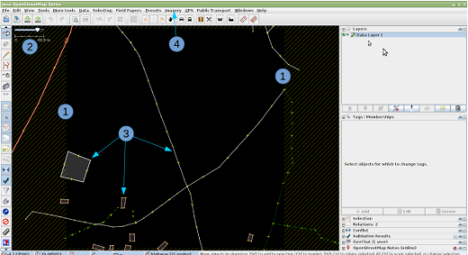

   Vista inicial de JOSM

1. El límite de su cuadrado se indica mediante el rayado cruzado. Hay un
   muy ligero solapamiento de los cuadrados, por lo que un elemento en
   su cuadrado que esté en la frontera aparecerá dentro del límite del
   cuadrado adyacente. Sólo debe mapear los elementos del mapa dentro de
   su cuadrado para evitar 'conflictos', que se explican en otra parte.
   > Si el rayado cruzado delimitador no es visible, es posible que haya
   instalado el plugin '*Descargar continua de datos OSM*\ '. Para
   corregir esto tendrá que quitar el tic de este plugin en el menú
   Archivo de JOSM, borrar los datos descargados, y descargarlos de
   nuevo utilizando el Administrador de Tareas.
2. La escala de la vista se indica aquí. Este es un cuadrado muy
   pequeño, con una cifra de 40,8 metros - esta cifra es a menudo de
   varios kilómetros.
3. Varios elementos ya existen en la base de datos de OpenStreetMap, y
   éstas se han cargado. Vamos a explorarlas en un momento.
4. No hay imágenes de fondo cargadas en esta ocasión y tendrá que
   cargarla manualmente - las instrucciones de este proyecto en
   particular muestran que se debe cargar imaginería de Bing, y esto
   puede ser cargarse rápidamente haciendo clic en la palabra "imágenes"
   y a continuación, seleccionando 'Bing' en la lista desplegable. Es
   posible que deba alejar el zoom (girar la rueda central del ratón
   hacia usted) y luego acercar de nuevo para ayudar a cargar
   rápidamente las imágenes.

Vista inicial alternativa - JOSM
^^^^^^^^^^^^^^^^^^^^^^^^^^^^^^^^^^

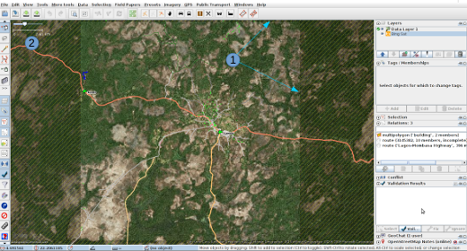

   Vistia inicial alternativa JOSM

1. Límites del cuadrado se indica mediante el rayado cruzado. Las
   imágenes de Bing se ha cargado, pero a esta escala las imágenes no
   tienen detalle.
2. La línea de escala indica 2,61 kilometros - esta es una zona de
   cobertura muy amplia.

Vista inicial - iD
~~~~~~~~~~~~~~~~~~~~~~~~

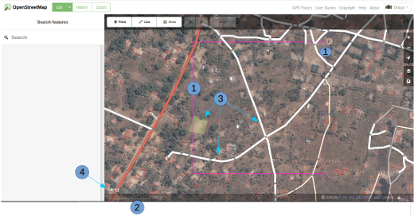

   Vistia inicial de iD

1. El límite de su cuadrado se indica mediante una línea morada. Hay un
   muy ligero solapamiento de los cuadrados, por lo que un elemento en
   su cuadrado que esté en la frontera aparecerá dentro del límite del
   cuadrado adyacente. Sólo debe mapear los elementos del mapa dentro de
   su cuadrado para evitar 'conflictos', que se explican en otra parte.
2. La escala de la vista se indica aquí. Este es un cuadrado muy
   pequeño, con la línea de 100 metros que se extiende bastante lejos en
   proporción a la longitud del cuadrado - esta cifra es a menudo varios
   kilómetros.
3. Varios elementos ya existen en la base de datos de OpenStreetMap, y
   éstas se han cargado. Vamos a explorarlas en un momento.
4. La imaginería de Bing ya se ha cargado como fondo.

Vista inicial alternativa - iD
^^^^^^^^^^^^^^^^^^^^^^^^^^^^^^^^^^

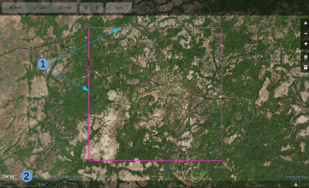

   Vista inicial alternativa de iD

1. Límites del cuadrado.
2. Para este cuadrado la escala indicada es 5 km, en la que los botones
   de edición en la parte superior de la pantalla aparecen en gris y no
   se pueden seleccionar.

Comprobación de los datos existentes - JOSM
~~~~~~~~~~~~~~~~~~~~~~~~~~~~~~~~~~~~~~~~~~~~~

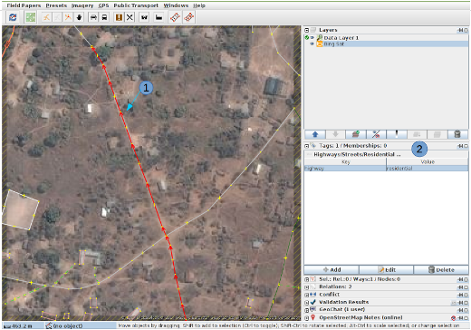

   Comprobando datos con JOSM

1. He hecho clic en uno de los elementos existentes en los datos de OSM,
   y ahora es de color rojo en la pantalla.
2. En el panel :guilabel:`Etiquetas/Membresías` a la derecha se puede
   ver que esta función se etiqueta con la clave de la carretera y un
   valor de residencial. Para facilitar la consulta de este denomina
   como
   highway=residential

La siguiente sección de esta guía indica cómo deben ser mapeados y
etiquetados los elementos.

Comprobación de los datos existentes - iD
~~~~~~~~~~~~~~~~~~~~~~~~~~~~~~~~~~~~~~~~~~~

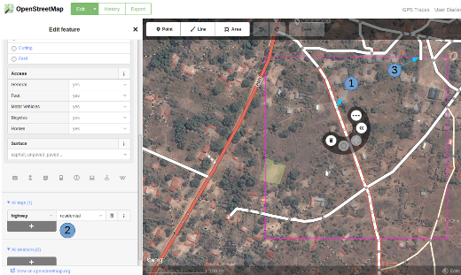

   Comprobación de datos con iD

1. He hecho clic en uno de los elementos existentes en los datos de OSM,
   y ahora se destaca con un borde rojo en la imagen, y iD está
   mostrando las herramientas disponibles.
2. iD me presentó con una serie de posibles etiquetas que podría
   utilizar esta característica en el lado izquierdo de la pantalla,
   pero para nuestro propósito he utilizado la barra de desplazamiento
   para bajar al rubro **Todas las etiquetas** donde podemos ver que la
   función tiene una clave de **carretera** y un valor de
   **residencial**. Para facilitar la consulta de este denomina como
   highway=residential
3. La persona que ha mapeado el cuadrado adyacente ha trazado una
   carretera de su cuadrado justo en la frontera en mi cuadrado y luego
   se detuvo. Esta es la forma correcta de 'entregar' una carretera o
   elemento en la frontera de su cuadrado.

La siguiente sección de esta guía indica cómo deben ser mapeadas y
etiquetadas las características `Trazar carreteras, edificios, agua y
uso de la tierra </es/coordination/remote-tracing/>`__.

Otras lecturas
-----------------

-  `Consejos de Mapeo HOT en África Occidental del usuario
   Bgirardot <http://wiki.openstreetmap.org/wiki/User:Bgirardot/Typical_Road_and_Residential_Task>`__
-  `Entrada del wiki OSM sobre
   validación <http://wiki.openstreetmap.org/wiki/OSM_Tasking_Manager/Validating_data>`__
-  `Etiqueta Highway África - la referencia preferida para el etiquetado
   de carreteras en
   África <http://wiki.openstreetmap.org/wiki/Highway_Tag_Africa>`__
-  `Tutorial Corto en francés para el mapeo a
   distancia <http://blog.cartong.org/2014/07/24/tuto-digitaliser-sous-openstreetmap-avec-le-tasking-manager-et-josm-premiers-pas/>`__

Cartografiando entidades
===========================

Carreteras
--------------

En OpenStreetMap cualquier tipo de carretera, de autopistas a pistas y caminos,
se etiquetan como *highway*. Es importante que las carreteras se añadan
correctamente a la base de datos, ya que se emplean de muy diversas maneras:

- Programas de navegación como el de los dispositivos *Garmin* y aplicaciones
  para móviles como *Osmand* disponen de funcionalidad para calcular rutas a lo
  largo de grandes distancias, si la información que se les carga es correcta.
  Ya que se apoyan en el GPS del dispositivo para obtener la posición en
  relación al mapa base que se le ha cargado, es muy importante que las
  carreteras estén a menos de 15 metros de la posición correcta.... ¡o no
  funcionarán!

- Si puedes diferenciar bien entre un camino, una carretera principal, y todas
  las tipologías intermedias, es mucho más fácil planificar la ruta de un gran
  camión de ayuda.

- Saber si la superficie de tu carretera es asfalto o barro blando marcará una
  gran diferencia en la planificación de tu ruta.

- Cuando uno intenta determinar geográficamente la extensión de una enfermedad,
  es significativo si una victima te dice *cerca del cruce de caminos* si
  efectivamente puedes observar ese cruce de caminos en el mapa.

Cómo cartografiar carreteras
~~~~~~~~~~~~~~~~~~~~~~~~~~~~~~~~~

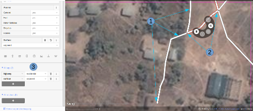

1. Al cartografiar carreteras, asegúrate de que te has acercado lo suficiente.
   Como guía para empezar pon la escala sobre los 20 metros, y dibuja la
   carretera de tal manera que tu dibujo tenga los suficientes puntos para
   superponerte a la carretera que ves en la imagen, o al menos para quedarte
   muy cerca. En el pantallazo de arriba puedes ver cómo hemos cartografiado la
   carretera que se nos ha pasado, hacia abajo, a través de los árboles, y
   abajo de nuevo  hacia otro edificio donde aparentemente termina. Allí donde
   los árboles están cerca de la carretera, y dado que la imagen está tomada
   por una cámara cenital, parece que la carretera se estrecha al pasar a
   través de los árboles, pero es solo el efecto de los árboles al oscurecer la
   vista, y la carretera es del mismo ancho todo el tiempo.

2. Hemos cartografiado también otra sección de la carretera, asegurándonos de
   que está conectada en el otro extremo. iD muestra esto con un punto
   coloreado ligeramente más grande y oscuro en la unión. Es importante que las
   carreteras se unan y *compartan un nodo común* para que los programas de
   cálculo de rutas puedan proporcionar las instrucciones adecuadas.

3. La carretera se etiqueta como *highway=residdential* y también hemos añadido
   la etiqueta *surface=unpaved* para indicar que no está asfaltada.

4. Para una descripción completa del etiquetado usado en África, echa un
   vistazo a esta página wiki (en inglés) `Highway Tag Africa
   <http://wiki.openstreetmap.org/wiki/Highway_Tag_Africa>`_.

.. note:: Podrás prevenir un alto riesgo de sufrir conflictos si grabas tu
   trabajo cuando trabajas con cualquier carretera que se extiende a otras
   celdas mientras otros colaboradores están también editando. Es aconsejable
   salvar todos los cambios antes de editar la carretera, y entonces salvar los
   cambios con bastante frecuencia, como por ejemplo cada vez que añadas unos
   seis nodos.

La red de carreteras
~~~~~~~~~~~~~~~~~~~~~~~

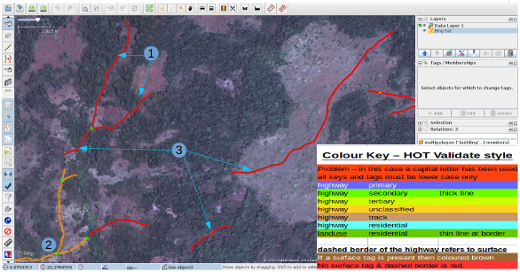

Esta captura de pantalla muestra JOSM con el estilo de validación de HOT OSM,
disponible en `JOSM styles <https://josm.openstreetmap.de/wiki/Styles>`_.
Aunque está diseñado para asistir a los validadores, puede ser muy útil para
realizar el cartografiado inicial. Cualquier cosa que esté dibujada en rojo
tiene algún tipo de problema. El resto de colores se explican en la leyenda de
la captura de pantalla.

1. Esta sección de la carretera está en rojo porque la etiqueta se ha escrito
   de forma incorrecta, usando una letra mayúscula. La etiqueta debería ser
   *highway=unclassified*, que habría resultado en la captura de pantalla en un
   color marrón pálido.

2. Esta es la parte de la red de carretera para el pueblo que aparece en la
   zona sudoeste. Esta red conecta con el resto de la red de carreteras de
   África.

3. Estas secciones de la carretera están *aisladas*. No conectan con el pueblo
   o con otras carreteras de ninguna manera. En su forma actual no son muy
   útiles y será necesario investigarlas más para comprobar si se pueden
   conectar de alguna manera al resto de la red de carreteras, o si tal vez
   sería conveniente simplemente borrarlas.

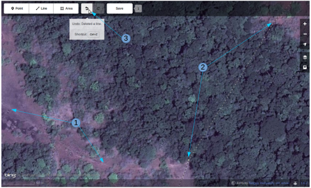

    **¿Carretera o arroyo?**

No hay estilos de visualización disponibles para iD, pero en esta pantalla
puedes ver un área de vegetación y sus alrededores. El terreno parece cortado o
tal vez incluso se trate de una zona de marisma sin el agua en el momento en el
que se tomó la imagen. Las líneas punteadas en blanco y negro representan
senderos en iD y hemos resaltado temporalmente una para después borrarla para
así ver el terreno.

1. *highway=path* o tal vez el lecho de un arroyo. ¡Puede que incluso ambos! Es
   habitual que carreteras de todo tipo sigan el valle de un curso fluvial y en
   muchos casos siguen el curso de un río o arroyo estacional. En este caso
   esto parece ser una zona  plana de inundación, seca en el momento en que el
   satélite tomó la imagen, y que se está usando como camino. La mejor forma de
   etiquetar esto sería entonces: *highway=path; seasonal=yes;
   surface=unpaved*.

2. El sendero puede verses claramente yendo a través de la franja de árboles y
   la zona de matorrales, pero no es posible ver el trazado exacto a través de
   los árboles. En estas circunstancias puedes estar seguro de que hay un
   camino, sendero o carretera, simplemente no lo puedes ver por culpa de los
   árboles. Hemos cartografiado esto continuando el camino que estábamos
   dibujando dibujando una línea recta hasta la salida que podemos ver con
   claridad en el otro lado. Es conveniente utilizar esto con precaución, pero
   en este caso es obvio que el camino existe y que es muy probable que más o
   menos siga la línea que hemos dibujado. Ciertamente éste es un caso un poco
   extremo, es más habitual estimar el trazado de una carretera solo por unos
   pocos metros, donde uno o dos árboles tapan la vista.

3. Habiendo borrado el camino para poder ver el suelo claramente, es sencillo
   volverlo a reponer utilizando la herramienta deshacer (*undo*) de iD.

Límite de zonas residenciales
---------------------------------

Los límites de las zonas residenciales se utilizan en OpenStreetMap para todo
tipo de propósitos.

+ El uso más simple es poder apreciar las zonas residenciales a partir de
  ciertos niveles de *zoom* cuando se explora la cartografía de
  `OpenStreetMap.org <http://www.openstreetmap.org>`_, donde estas zonas se
  pintan de un color gris claro en la vista estándar.

+ Donde no hay tiempo suficiente para cartografiar en detalle, el proyecto del
  *Tasking manager* es común que solicite algo como esto:

.. note:: Cartografiar las infraestructuras esenciales como escuelas, lugares
   de culto y mercados.  Trazar los límites exteriores de los asentamientos y
   cementerios. Dibujaremos las carreteras más tarde en otra tarea.

+ La etiqueta *landuse=residential* también se utiliza para propósitos
  estadísticos, por lo que un cartografiado preciso en este caso se vuelve
  importante.

+ Si puedes establecer cuánta gente vive normalmente en cada vivienda, y
  cuántas viviendas normalmente se construyen en una zona dada, entonces una
  vez calculas el área cubierto por un límite *landuse=residential*, puedes
  obtener una aproximación bastante buena de la población para ese área. De
  esta forma se puede estimar de una forma mucho más realista el número de
  asistentes y medicinas son necesarios.

+ Los nombres de los lugares y los límites se importan a menudo desde otras
  fuentes de datos, pero es frecuente que la localización no sea precisa. Una
  vez tienes el límite de la zona residencial, la persona haciendo la
  importación puede ver dónde colocar con mayor probabilidad el nombre del
  lugar.

Cómo cartografiar *landuse=residential*
~~~~~~~~~~~~~~~~~~~~~~~~~~~~~~~~~~~~~~~~~~~

**En un mundo ideal**

*Fase 1* - Se toma la decisión de cartografiar un área, un colaborador
rápidamente establece un límite aproximado alrededor del área con
*landuse=residential*

*Fase 2* - Se crea el proyecto en el *Tasking manager* y colaboradores
individuales refinan el límite para que esté más cerca de los edificios, etc.

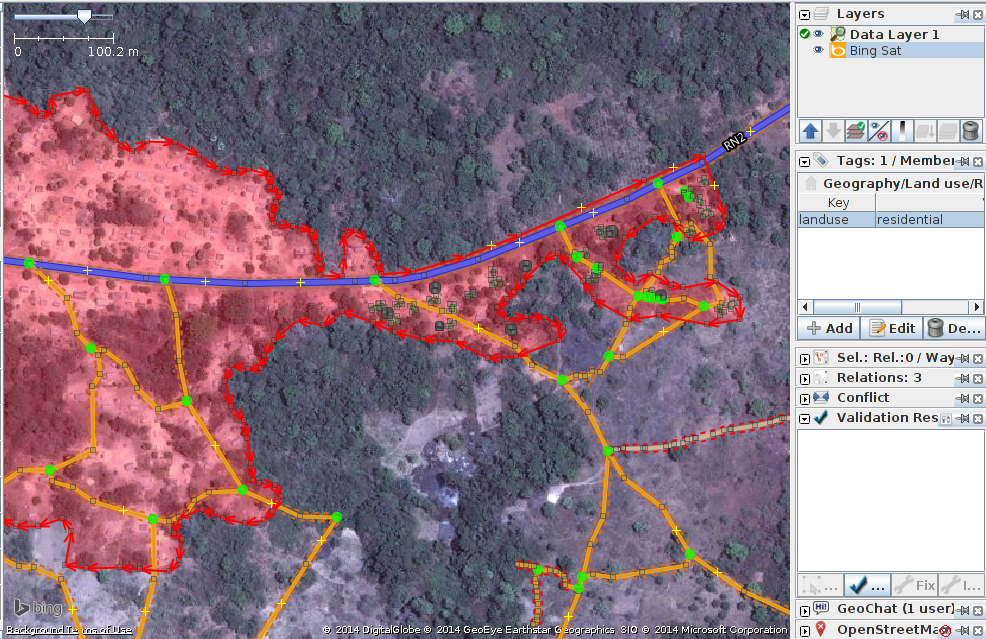

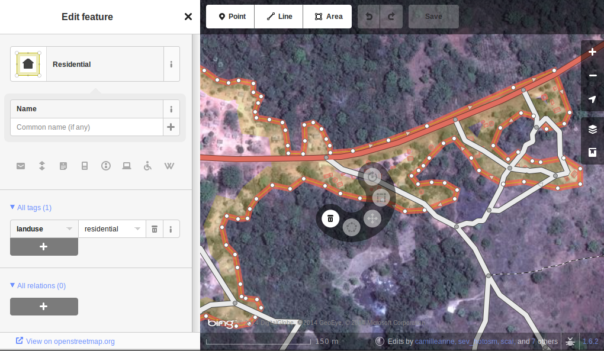

En las pantallas de arriba se pueden ver los límites de una zona
*landuse=residential* correctamente cartografiada en iD y JOSM.

1.  El límite tiene que estar cerrado, es decir el punto inicial de la línea
    (*way*) debe unirse con el punto final.

2.  Los segmentos y nodos del límite no se unen con carreteras, elementos
    fluviales, edificios o cualquier otra característica. Es decir no deben
    compartir ningún nodo, aunque pueden cruzar otras vías.

3.  El límite debe encontrarse relativamente cercad edificios, así como
    jardines y patios que forman parte de la zona urbana.

En la captura de pantalla siguiente nuestra celda contiene parte de un límite
*landuse=residential*. La persona que completó la celda a la derecha continuó
un límite *landuse=residential* más allá de su celda *pasándola* al poner los
límites dentro de la nuestra, de tal manera que nosotros podamos continuar el
trabajo estableciendo dónde debe cartografiarse en la celda en la que estamos
trabajando.

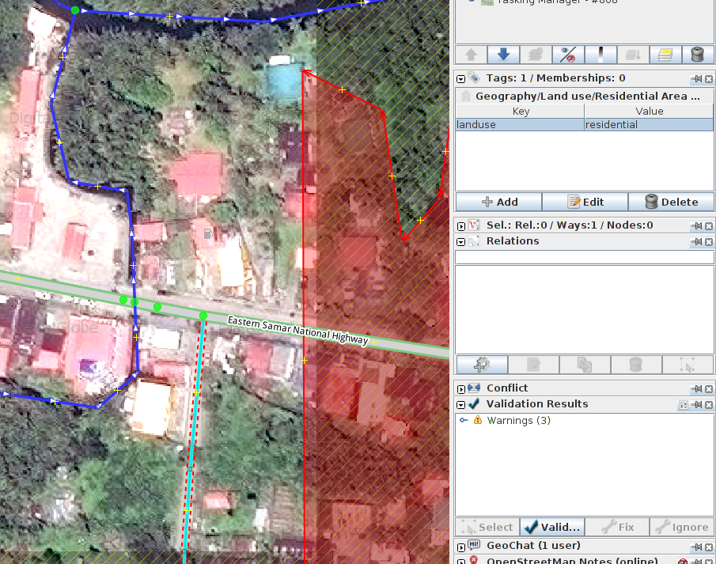

Añadiremos más nodos al límite, extendiéndolo horizontalmente más allá de
nuestra celda para rodear los edificios, y en el fondo continuaremos el límite
como una línea recta justo dentro de la celda inferior para que la persona que
seleccione esa celda pueda igualmente extenderla más allá de los edificios que
pueda contener.

Esta es una operación delicada, uno solo puede ver una pequeña parte de un
todo, sea un pueblo, ciudad o villa, y aunque seguramente lo haremos todo lo
bien que podamos, es más que probable que tras ser cartografiadas algunas
celdas individuales, un validador tenga que repasarlas para limpiar el límite
*landuse=residential*.

.. note:: Hay un alto riesgo de sufrir conflictos cuando se trabaja con límites
   *landuse=residential*, ya que al extenderse más allá de nuestra celda otros
   colaboradores estarán trabajando con la misma entidad. Es recomendable
   salvar todos los cambios antes de editar un límite, y salvar los cambios en
   intervalos frecuentes, como por ejemplo cada vez que se dibujen unos 6
   nodos.

Edificios, recintos y barreras
-------------------------------

Hay varias razones por las que es interesante añadir edificios al mapa:

* La densidad de los edificios en un área es un buen indicador del número de
  personas que residen en ella.

* El tamaño, forma y localización de un edificio ayuda a identificarlo como un
  lugar potencialmente útil en evacuaciones o tratamientos.

* El tamaño forma y localización relativa de los edificios puede usarse para
  identificar lugares particulares como pozos, estaciones de ayuda, escuelas,
  etc.

* Existe un uso potencial relacionado con la estimación del daño potencial que
  puede soportar un edificio, el cual puede usarse para estimar el número de
  víctimas y la cantidad de ayuda que sería necesaria. Esto esta actualmente
  (enero de 2015) en discusión para un uso futuro.

Cómo cartografiar edificios
~~~~~~~~~~~~~~~~~~~~~~~~~~~~~~~~~~~~

La gran mayoría de los edificios que el HOT cartografía están o bien basados en
formas rectagulares con esqinas cuadradas o bien son circulares. Si un edificio
parece una mezcla de ambos, lo más probable es que estés observando un edificio
cuyo borde está oscurecido por una sombra, un reflejo, el follaje o algún
obstáculo similar.

Para algunas tareas, solo es necesario dibujar el borde del área ocupada,
también puede ser que la tarea especifique que se marquen los edificios
mediante nodos individuales, aunque estas situaciones son raras hoy en día.

*building=yes*
^^^^^^^^^^^^^^^^^^^^^

Salvo que las instrucciones del proyecto digan otra cosa, los edificios deben
etiquetarse mediante el par *building=yes*.

* Siempre existe un espacio de tiempo desde que el satélite toma la imagen
  hasta que se realiza la edición cartográfica. Por lo tanto existe la
  posibilidad de que el edificio que estás viendo que no tiene techo, ahora
  esté ya completado y por tanto se trate ya de una vivienda. Es también
  posible enfrentarse a un edificio con varias alturas en las que las plantas
  bajas estén habitadas y las plantas superiores se encuentren vacías.

**Cartografiando edificios con iD**. Cuando usas la herramienta de dibujo de
áreas en iD para crear una forma simple, debes recordar el cambiar la etiqueta
a *building=yes* ya que la configuración por defecto usará la etiqueta más
genérica de *area=yes*.

* JOSM es una herramienta más rápida para dibujar edificios. Consulta `las
  herramientas de JOSM para dibujar edificios
  <http://learnosm.org/en/editing/more-tools/#the-buildings-tools-plugin>`_.

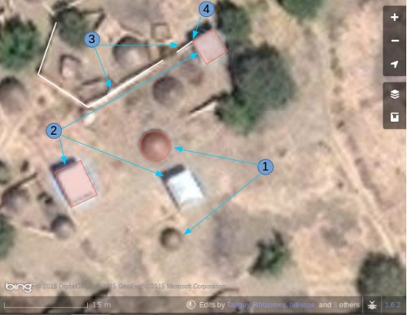

Parte de una celda se está editando en esta captura de pantalla. Nótese la
escala en 15 metros abajo, esa es más o menos a la que se debería trabajar al
cartografiar este tipo de entidades. Al cartografiar, se debe intentar trazar
el lugar que ocupa el edificio sobre el terreno:

1. **Edificios circulares**. En este caso, suelen ser bastante bajos en altura
   y su sombra es casi invisible. Si te encontraras de frente a uno de ellos te
   parecería un domo. Hasta la fecha el autor solo ha encontrado un caso de
   este tipo. Para añadir rápidamente el resto de edificios circulares el
   procedimiento podría empezar por seleccionar el edificio dibujado
   (resaltándolo), presionar *Control+C*, mover el cursor al centro de otro
   edificio del mismo tamaño y presionar *Control+V*. Cuando todos los
   edificios del mismo tamaño estuvieran digitalizados en la celda de trabajo
   se podría copiar sobre otro edificio de un tamaño diferente y
   redimensionarlo usando el ratón conjuntamente con *Alt+Control* hasta llegar
   al tamaño adecuado, entonces se vuelve a copiar y pegar sobre los edificios
   de ese tamaño y así sucesivamente.

2.  **Edificios rectangulares**. Este tipo de edificios generan una sombra
    bastante apreciable. La sombra puede servir para identificar la forma del
    edificio que puede haberse tapado parcialmente por otro objeto. Es fácil
    encontrar edificios que no sean tan sencillos, tal vez tienen un porche o
    una forma en "L". Es necesario trazar toda la forma del edificio, ya que
    esto sirve para identificarlos mejor cuando se les ha de añadir nombres o
    hay que validarlos sobre el terreno.

3. **Barreras, paredes (o setos) de un recinto**. Es necesario examinar las
   imágenes, acercarse y alejarse hasta estar satisfecho con la forma del
   objeto (tal vez usando igualmente la sombra para identificarlo), hasta tener
   claro que es una pared. Entonces se etiqueta con **barrier=wall**. Otras
   etiquetas alternativas son **barrier=fence** y **barrier=hedge**.

4. Hemos unido la **barrier=wall** con el **building=yes** en la esquina del
   edificio.

Distorsión en la forma de los edificios en las imágenes de satélite
^^^^^^^^^^^^^^^^^^^^^^^^^^^^^^^^^^^^^^^^^^^^^^^^^^^^^^^^^^^^^^^^^^^^^^

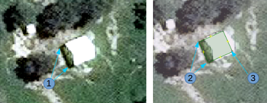

1.  En la imagen de satélite de arriba aparece un edificio, pero el satélite no
    estaba exactamente encima del edificio, por lo que en estos casos éstos
    aparecen distorsionados y una de sus paredes resulta visible en la imagen.
    Por este ángulo entre el satélite y el edificio, el tejado no se muestra
    como una forma rectangular. El sol está prácticamente sobre el edificio,
    por lo que la sombra del mismo, indicada por las flechas de la figura,
    confirman que el edificio es efectivamente rectangular.

2.  Para cartografiar este edificio, crea un rectángulo extendiendo desde las
    flechas del punto 2, hasta donde se estima que el edificio termina,
    indicado por el punto 3 en esta imagen.

Para más información, consultar los enlaces siguientes con más guías e
información útil.

Lecturas adicionales
~~~~~~~~~~~~~~~~~~~~~~~~~~

- `Consejos del usuario Bgirardot para el trabajo de HOT en África Oeste <http://wiki.openstreetmap.org/wiki/User:Bgirardot/Typical_Road_and_Residential_Task>`_.

- `Página del wiki de OSM relativa a la validación <http://wiki.openstreetmap.org/wiki/OSM_Tasking_Manager/Validating_data>`_.

- `La guía de referencia para el etiquetado de carreteras en África <http://wiki.openstreetmap.org/wiki/Highway_Tag_Africa>`_.

- `Pequeño tutorial sobre edición a distancia <http://blog.cartong.org/2014/07/24/tuto-digitaliser-sous-openstreetmap-avec-le-tasking-manager-et-josm-premiers-pas/>`_.
