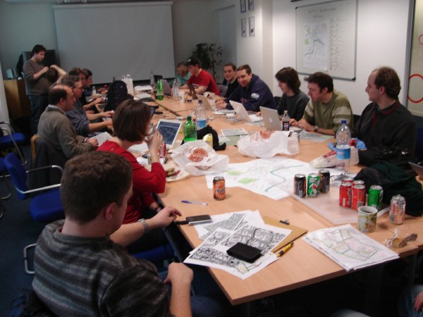
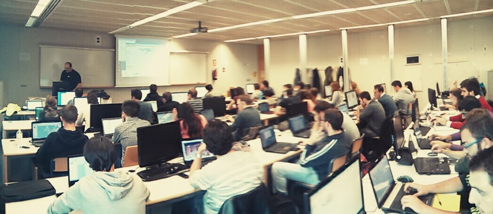
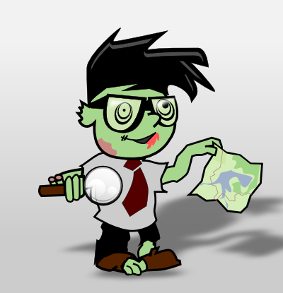
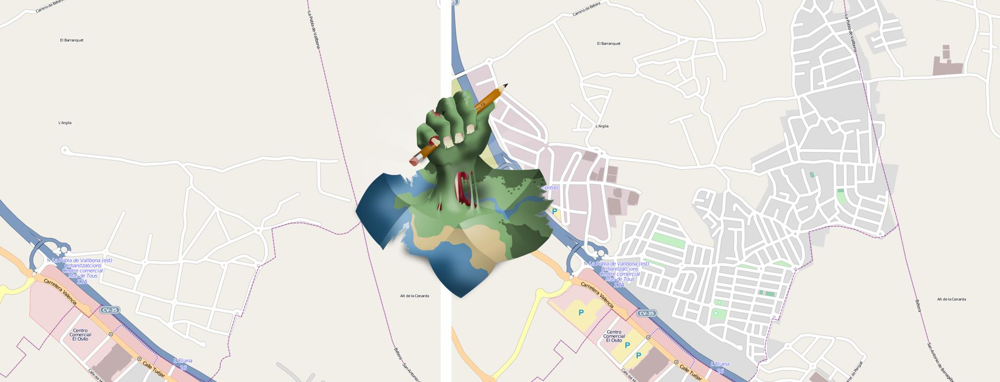

.. _mappinghot:

======================================================
Cómo montar Mapping Parties y Mapatones para el HOT
======================================================

.. contents:: Contenidos
   :depth: 3
   :backlinks: none

Mapping Party *How To*
==============================

.. note:: Texto extraído de la `guía para organización de Mapping Parties <https://wiki.openstreetmap.org/wiki/ES:Mapping_Weekend_Howto>`_

¿Qué es una *mapping party*?
--------------------------------------

Una *mapping party* es donde un grupo de colaboradores de OpenStreetMap
(veteranos y novatos) se dirigen a algún lugar para cartografiarlo en detalle,
normalmente durante un fin de semana. Es un tipo de evento muy social, donde
la gente habitualmente se reúne y charla entre sesiones de toma de datos
(normalmente en un bar, una biblioteca o un centro cultural).
Una sesión de toma de datos consiste en repartir
entre los participantes un área dividida en zonas, y se sale a cartografiarla,
bien en coche, en bicicleta o andando. Para una descripción más detallada de
qué es una *mapping party* puedes echar un vistazo a la página `Mapping
parties`_.

.. _Mapping parties: https://wiki.openstreetmap.org/wiki/Mapping_parties

Ya han tenido lugar un gran número de *mapping parties*, ¡a lo largo y ancho
de todo el mundo! Si no ha habido ninguna cerca de donde te encuentras, por
favor considera el organizar una siguiendo los consejos de esta guía.

   Mapping Party en Londres

.. hint:: Puedes consultar más información sobre qué es una *Mapping Party*
          en el `wiki de OpenStreetMap <http://wiki.openstreetmap.org/wiki/ES:Mapping_parties>`_.

Arrancando
-------------------

Para conseguir una *mapping party* exitosa necesitas tres ingredientes clave:
un lugar, gente y una fecha. Encontrar un buen lugar es normalmente lo más
difícil de conseguir. El resto simplemente irá a su sitio.

* **Cuándo** Una vez tienes una localización aproximada (*Valencia* o
  *Sevilla*    por ejemplo) y un par de personas, pon una página en el wiki con
  todos los detalles y confirma la fecha. El resto es fácil. Ese día, salvo que
  tengas muchos novatos, todo ocurrirá por si mismo, así de fácil.

* **Dónde** El lugar más sencillo es un bar, preferiblemente con WiFi gratuita.
  O tal vez seas capaz de encontrar una empresa, un centro cultural, una biblioteca
  o un auditorio que puedan ofrecer espacio libre y gratuito durante el fin de semana.

* **Quién** Lo siguiente es conseguir que algunas personas se apunten. Es
  conveniente intentar contactar con dos o tres colaboradores locales antes para
  ver si las fechas les acomodarían. Para algunos ha sido útil elegir una fecha
  usando una encuesta en `doodle.com`_. En cualquier caso, simplemente intenta
  encontrar unos pocos colaboradores que estén comprometidos antes de hacer un
  anuncio general.

.. _doodle.com: http://doodle.com

Planificiación
---------------------

Esta es una lista de cosas que hay que hacer previamente

Fecha
~~~~~~~~~~~

* Anuncia tu evento **al menos** con dos meses de adelanto. No elijas un fin de
  semana que pueda solaparse con períodos vacacionales o festivos importantes.

* Elige un fin de semana

Lugar
~~~~~~~~~~

* Elige un lugar que se encuentre razonablemente cerca de algún medio de transporte
  como aeropuertos, estaciones de tren o autovías. Recuerda: es probable que haya
  gente que venga de lejos.

* Elige lugares de reunión para comidas y cenas que sean adecuados para familias
  (puede que haya gente que traiga niños).

  * Asegúrate de que tu lugar no requiera de algún tipo de seguro de
    responsabilidad (algunas oficinas o espacios comunitarios puede que lo
    pidan) - echa un vistazo a la página de discusión de la versión en inglés de
    esta página para más detalles.

  * El bar de la tarde y cena realmente importa. Crear comunidad está muy
    relacionado con la interacción social, por lo que busca un buen bar y dile
    a todo el mundo que después de la actividad os reuniréis allí a tomar algo.

* Obtén las coordenadas geográficas (latitud/longitud) de los lugares de reunión
  y anúncialos previamente.

  * Intenta ir a algún sitio con WiFi gratuita.

Otros
~~~~~~~

* Arranca una página en el wiki. Puedes copiar y pegar el texto de la plantilla
  en inglés `Mapping Party Template`_, o usar tus propias palabras y formato.

  * Pon tu número de teléfono en el wiki

  * Da unas indicaciones claras sobre cómo encontrar a las personas adecuadas si
    vais a reuniros en un lugar público.

  * Pon un mapa en la página (usa la sintaxis &lt;map> o &lt;slippymap>, o tal
    vez carga tu propia imagen personalizada).

  * Haz un diagrama *en pastel* para trocear el área en secciones manejables.
    (Para ver un ejemplo puedes echar un vistazo  a la página
    `London mapping party`_). Puedes encontrar más detalles sobre cómo hacer un
    diagrama en pastel en `Mapping Weekend Howto/Cake Diagram`_.

* Asegúrate de que no hay previstos trabajos de mantenimiento en la calle o
  cualquier otra eventualidad en el transporte para la fecha seleccionada.

.. _Mapping Party Template: https://wiki.openstreetmap.org/wiki/Mapping_Party_Template
.. _London mapping party: https://wiki.openstreetmap.org/wiki/London_mapping_party
.. _Mapping Weekend Howto/Cake Diagram: https://wiki.openstreetmap.org/wiki/Mapping_Weekend_Howto/Cake_Diagram
.. _

Durante el evento
-----------------------

Asegúrate de tener el *hardware* y *software* necesarios como:

* Lector de tarjetas SD (para las unidades GPS y similares)
* Un cable de serie para Garmin (y un conversor de serie a USB
  si lo vas a necesitar)
* JOSM_
* GPSBabel_
* El *software* para las unidades GPS si es necesario
* Cámara de fotos
* Herramientas para móviles como `OSM Contributor Mapping Tool`_ o Vespucci_

.. _JOSM: https://wiki.openstreetmap.org/wiki/JOSM
.. _GPSBabel: https://wiki.openstreetmap.org/wiki/GPSBabel
.. _OSM Contributor Mapping Tool: https://wiki.openstreetmap.org/wiki/OSM_Contributor_Mapping_Tool
.. _Vespucci: http://wiki.openstreetmap.org/wiki/Vespucci

Unidades GPS
~~~~~~~~~~~~~~~

Salvo que vayas a cartografiar una ciudad bien cubierta por `imágenes aéreas`_,
vais a necesitar para trabajar hacer uso de `unidades GPS`_.

* Obtén depósitos (tarjeta bancaria/pasaporte) y datos de contacto de todos
  aquellos a quiénes prestes una unidad GPS

* Asegúrate de que las unidades GPS tienen suficiente batería y que están vacías
  de datos

* Asegúrate de que las unidades GPS están configuradas para grabar posiciones y
  que los novatos saben cómo realizar las operaciones básicas

* Asegúrate de que los novatos saben que los GPS deben trabajar en zonas
  despejadas para observar los satélites.

.. _imágenes aéreas: https://wiki.openstreetmap.org/wiki/Aerial_imagery
.. _unidades GPS: https://wiki.openstreetmap.org/wiki/GPS_Unit

.. _mp-publi:

Publicidad
-----------------

Promoción en *Internet*
~~~~~~~~~~~~~~~~~~~~~~~~~~~~~~~

* Hay *muchos* sitios que listan eventos, así como servicios de calendario donde
  puedes añadir tu *mapping party*. Éstos ofrecen un buen medio para hacer to
  evento más *descubrible*. Muchos de ellos de hecho también gestionarán por ti la
  lista de suscritos. Si te listas en más de uno de estos sitios, ofrece unas
  instrucciones claras sobre cual es el método de registro requerido, si es que
  hay alguno. Ayuda a la gente a encontrar estos listados etiquetándolos con *osm*
  y *openstreetmap* (sí, ambos), y enlazándolo desde la página del evento en el
  wiki de OSM.

  * http://lanyrd.com - ¡Utiliza mapas de OpenStreetMap!

  * http://eventbrite.com - Aparentemente es un sitio popular para eventos de pago,
    o eventos donde hay un número limitado de *tickets*. Mucho contenido sobre
    imprimir tickets que no tiene mucho sentido.

  * https://ti.to

  * http://attending.io

  * https://splashthat.com

  * http://joind.in

  * http://meetup.com - ¡Cuesta dinero! Por alguna razón, este sitio es una
    opción bastante popular, pese a que existan muchas alternativas gratuitas.
    `OSM EEUU tiene una cuenta`_

* Busca grupos locales de entusiastas de la tecnología (como por ejemplo grupos
  locales de Linux) y contacta con ellos.

* Busca el artículo en Wikipedia que mejor se adapta a la localización. Añade
  una nota en la página de discusión. Intenta evitar sonar demasiado a *spam*,
  puedes justificar la promoción ya que la actividad va a resultar en un mejor
  mapa para ilustrar precisamente ese artículo de la Wikipedia.

* *Hay muchísimas más maneras de hacer promoción en Internet*.

.. _OSM EEUU tiene una cuenta: http://openstreetmap.meetup.com

Nota de prensa
~~~~~~~~~~~~~~~~~~~

* Prepara una nota de prensa. Hecha un vistazo a `Writing a press release`_ para
  consultar consejos y ejemplos.

* Envía la nota de prensa con unas tres semanas de antelación a:

  * Periódicos locales (utiliza esta estupenda página: http://news.mysociety.org o
    una búsqueda en Google por *noticias locales* para encontrar recursos)

  * Emisoras de radio

  * Museos, bibliotecas, etc

  * Foros y sitios web

  * Oficinas de turismo

.. _Writing a press release: https://wiki.openstreetmap.org/wiki/Writing_a_press_release

Póster
~~~~~~~~~~~~

* Prepara un póster. Echa un vistazo a `Recruitment Poster`_  para ver un texto
  propuesto, enlaces y ejemplos de otros pósteres publicados.

* Un par de semanas antes del evento distribúyelos:

  * En el lugar del evento

  * Pregunta en tiendas de la zona para poner el póster en su ventana

  * Museos y bibliotecas locales

  * Etc.

.. _Recruitment Poster: https://wiki.openstreetmap.org/wiki/Recruitment_Poster

Folletos
~~~~~~~~~~

* Prepara un folleto (*flyer*) para poder repartir entre aquellos que quieran
  saber más. Echa un vistazo a `Flyers and posters`_ para ver los folletos
  genéricos disponibles para imprimir, o tal vez ficheros de gráficos que puedan
  serte útiles.

* Imprime unas cuantas copias para tenerlas disponibles el día de la *mapping party*.

.. _Flyers and posters: https://wiki.openstreetmap.org/wiki/Flyers_and_posters

Agenda
------------

Prepara una agenda detallada para el fin de semana y súbela con antelación a la
página del evento en el wiki.

* Planifica un evento social o quedada en un bar el viernes por la tarde, para
  aquellos que lleguen pronto.

* Empieza con una reunión de arranque (*kick-off*) como primera actividad de los
  dos días. Deja al menos una hora para esto.  Anima a los participantes a ponerse
  manos a la obra tan pronto como estén listos (especialmente los veteranos).

* Planifica sesiones de cartografiado de como máximo unas tres horas, ya que
  muchos GPSs necesitarán recargarse tras ese tiempo.

* Organiza adecuadamente puntos de reunión y asegúrate de que habrá alguien allí
  con un equipo portátil (así como cables, etc.) para cargar los *tracklogs* (y
  tal vez crear un `Party Render`_). Un bar con WiFi gratuita y comida sería una
  buena localización.

* Planifica una hora de cierre para el trabajo del día. Incluye una sesión cada
  día para explicar a los novatos cómo subir y etiquetar sus *tracks*. Anima a
  los novatos a que hagan ellos mismos el etiquetado.

* Planifica un evento social el Sábado por la noche. Por ejemplo quedar a tomar
  algo y luego a cenar.

* Es posible que aquellas personas que hayan ido el sábado estén cansadas el
  domingo, o tal vez menos predispuestas a socializar y más interesadas en
  simplemente continuar con el trabajo.

.. _Party Render: https://wiki.openstreetmap.org/wiki/Party_render

Obtener retroalimentación de la actividad
--------------------------------------------

Ideas para las preguntas que se podrían hacer a cada uno de los asistentes...

  Nos encantaría conocer tu opinión sobre la actividad de hoy, nos ayuda a hacer
  estas *mapping parties* aún mejores y así mejorar vuestra experiencia y en
  definitiva crear un mejor mapa.

  * ¿Qué días estuviste?

  * ¿Te consideras un local, o tuviste que viajar para venir a la actividad? Local/No local

  * ¿Habías asistido anteriormente a una *mapping party*? Sí/No

  * ¿Habías contribuido a OSM con anterioridad? Sí/No

  * Si es así, ¿habías obtenido datos anteriormente usando un GPS? Sí/No

  * ¿Fecha de llegada?

  * ¿Hora de salida prevista?

  * ¿Traes tu propio GPS o te lo hemos prestado? Mío/Préstamo

  * Si te lo hemos prestado, ¿cómo de difícil te ha sido usarlo?
    (1=fácil, 10=difícil) 1 2 3 4 5 6 7 8 9 10

  * ¿Cuántas horas has estado fuera tomando datos?

  * Si hemos proporcionado refrescos, ¿eran lo que necesitabas? Sí/No

  * Si hemos proporcionado alimentos a la hora de la comida, ¿fueron de ayuda o
    hubieras preferido ir por tu cuenta? Sí/Prefiero ir por mi cuenta

  * ¿Esperas cuando te marches, continuar editando el mapa y añadir tu
    conocimiento del día de hoy? Sí/No

  * Si es que no, ¿hay algo que podamos hacer para convertirlo en un Sí?

  * Si necesitaste ayuda técnica, ¿cómo de útil fue?
    (1=insuficiente, 10=más que suficiente): 1 2 3 4 5 6 7 8 9 10

  * Como resultado del día, ¿qué probabilidades hay que asistas a otra *mapping
    party* en el futuro? (1=poco probable, 10=seguro) 1 2 3 4 5 6 7 8 9 10

  * ¿Te gustaría estar al tanto de la información relativa a los resultados de
    esta *mapping party*? Si es así por favor danos tu dirección de correo
    electrónico aquí:

  * Si además, te gustaría que te informáramos por correo electrónico de otras
    mapping parties* que podamos organizar en el futuro, marca esta casilla.

Enlaces
--------------

* `Notas`_  de Andy Robinson sobre la organización de una *mapping party*

* http://wiki.openstreetmap.org/wiki/Mapping_Weekend_Howto

.. _Notas: http://lists.openstreetmap.org/pipermail/talk-gb/2010-February/008759.html

Mapatones para el HOT
=========================

   Mapatón en Valencia por el tifón Yolanda

Un **Mapatón** (*mapathon* en inglés) es un esfuerzo coordinado de cartografiado
en OpenStreetMap, en general como una sesión de :ref:`cartografiado de sillón
<remote>`. Suelen convocarse de forma global para toda la comunidad y en respuesta
a situaciones de crisis de especial relevancia. También pueden convocarse con
motivo de la celebración de algún evento o simplemente como forma de hacer
difusión del proyecto, como es el caso de la `Noche de los Mapas Vivientes`_, en
en el que se convocó a la comunidad a pasar una noche en vela cartografiando.

   Ejemplo de antes y después en la Noche de los Mapas Vivientes.

En mapatón por tanto es una sesión que tiene un objetivo doble:

* Por un lado se pretende **responder a una necesidad concreta y bien definida** que
  en general será una activación especialmente urgente del HOT_. Por lo tanto
  no es un taller exactamente, o una jornada para aprender sobre cómo funciona
  |OSM| sino como mucho para aprender lo justo para poder colaborar en los objetivos
  marcados.

* Por otro lado es una ocasión excelente para **atraer la atención** de posibles
  nuevos colaboradores, siempre va a ser atractivo ofrecer la oportunidad de
  participar en una actividad de ayuda **real** en un evento llamativo pero
  lejano.

Preparación
----------------

En esencia la preparación de un *Mapatón* es muy similar a la de una *Mapping
Party* normal, salvo que se trata de un evento mucho más reducido y por tanto en
teoría sencillo de organizar. Un mapatón suele organizarse para una única
jornada o incluso media jornada, seguramente por la tarde de forma que sea más
sencillo para los asistentes acudir.

Al igual que con una *Mapping Party*, lo más importante es conseguir un buen
lugar para trabajar. Algunas opciones habituales son:

* Laboratorios con equipos informáticos en centros educativos, especialmente en
  universidades.
* Espacios públicos con suficiente capacidad como bibliotecas o centros culturales
* Espacios privados que se presten a ceder sus instalaciones como centros de
  *coworking*, organizaciones sin ánimo de lucro o incluso bares o cafeterías
  si el día elegido es tranquilo.

.. figure:: https://farm2.staticflickr.com/1628/26478732772_42027f44a5_z_d.jpg
  :align: right
  :alt: Ejemplo de mapatón en unas oficinas

  Ejemplo de mapatón en unas oficinas

Lo mínimo que se necesita es:

* Mesas, sillas y enchufes suficientes. Si hace falta, pedir a la gente traer
  algunas regletas.

* Asegurar que hay conexión a Internet suficiente para la capacidad del local

Con esto ya se puede empezar, es poco pero puede ser suficiente dependiendo del
perfil de los asistentes.

Además es conveniente disponer de una pantalla y un proyector para poder hacer
demostraciones, charla inicial introductoria, etc.

Finalmente, si además el espacio es fácilmente accesible mediante transporte
público, existe cerca algún bar o restaurante para poder parar a comer sin
perder mucho tiempo, máquinas de refrescos, etc hará que el mapatón sea más
cómodo para los asistentes.

Todo esto y el resto de la documentación que vayamos a producir sobre el
mapatón es conveniente ir dejándolo por escrito en el wiki de |OSM|.

Difusión
-------------

Se pueden seguir las mismas recomendaciones que se exponen en el apartado sobre
:ref:`publicidad <mp-publi>` de la sección anterior, considerando que el evento
probablemente va a ser interesante para un entorno más local y que, en función de
las capacidades del local y de la respuesta de la comunidad a llamamientos anteriores,
puede ser interesante enfocar la difusión para colaboradores a OSM ya existentes,
o tal vez a nuevos posibles colaboradores.

En el segundo caso, es interesante por tanto hacer énfasis en difundir la celebración
del mapatón en entornos universitarios y en el ámbito de las ONGs, donde el objetivo
de la actividad puede resultar atractivo y motivador.

Contar con contactos en grupos tecnológicos locales, listas de correo y *newsletters*,
grupos en redes sociales y cualquier otro medio de comunicación pueden resultar
útiles. Hay que dedicar cierto tiempo a llegar a esos foros no tecnológicos donde
seguramente encontraremos potenciales nuevos colaboradores.

Es conveniente en el wiki ir dejando constancia de aquellos medios donde se hagan
eco del evento, así como cualquier dificultad o tarea sin terminar de difusión que
pueda ayudar a evitar perder el tiempo en futuros mapatones.

Organización del trabajo
-------------------------

Algunas cosas que se pueden pedir a los asistentes traer:

* Traer un portátil si tus instalaciones no tienen equipos

* Traer alguna regleta si se tienen a mano

* Venir con un navegador moderno instalado (*Google Chrome* o *Mozilla Firefox*)

* Venir con la máquina virtual Java instalada (si se va a editar con JOSM, dependerá
  del perfil medio de los usuarios que vendrán)

* Si pueden venir con una cuenta de OSM creada, mucho mejor

En las instalaciones:

* Tener preparadas hojas con las instrucciones para conectarse a Internet si son
  especialmente complicadas (como suele ocurrir en universidades)

* Tener descargada una máquina virtual Java y tal vez versiones portables para *Windows*
  de *Firefox* y JOSM al menos.

* Revisar mínimamente el estado de las tareas en el *Task Manager* que vamos a
  ofrecer a los asistentes, comprobar que las instrucciones para la configuración
  de los editores funcionan y cualquier otra indicación que haga falta pasar a los
  asistentes.

* Tener a mano una charla de introducción sobre OSM, o los enlaces a las guías de
  aprendizaje. Dejarlos bien visibles en el wiki del mapatón.

Durante el mapatón
-----------------------

Un mapatón, al igual que la sesión de edición de datos de una *Mapping Party* normal
puede dividirse en:

#. Bienvenida e introducción
#. Edición
#. Resultados y conclusiones.

Es importante al iniciar la sesión conocer los perfiles de los asistentes, tal vez sea
interesante dividirlos en grupos de mayor o menor experiencia. Por ejemplo:

*  **Usuarios novatos**: habrá que darles una charla de introducción específica y enseñarles
   las cuestiones más básicas. Seguramente sea interesante que se deciden a tareas
   de edición con **iD** que no requieran de grandes conocimientos en etiquetado. Deberán
   contar con el soporte de uno o varios colaboradores con experiencia que se quieran ofrecer
   a ayudarles. Es también probable que con este grupo sea necesario crear cuentas,
   configurar equipos y otras tareas que retrasarían al resto.

*  **Usuarios con experiencia**: estos usuarios seguramente ya han editado con iD o JOSM y
   solo necesitan que se les indique sobre qué zonas se va a cartografiar, qué tipo de
   entidades son más importantes y en general serán bastante autónomos, ya que aún con
   dudas, por si mismos podrán resolverlas.

*  **Usuarios expertos**: en el caso de contar con muchos usuarios con experiencia, tal vez
   los más veteranos puedan dedicarse a tareas de validación, ya que éstas suelen ser
   menos populares y requieren de cierta experiencia en el trabajo en el HOT.

Resultados y conclusiones
-----------------------

Es conveniente recordar a todos los colaboradores el utilizar algún tipo de etiqueta que
permita filtrar los *changesets* o generar algún tipo de visualización como la ofrecida
por `Result Maps <http://resultmaps.neis-one.org/osm-changesets#2/33.9/1.4>`_.

Además del balance cuantitativo, es recomendable anotar en el wiki las lecciones aprendidas,
así como hacer con el grupo algún tipo de retrospectiva que ayude a recoger las impresiones
tanto de asistentes como organizadores. Esta información, al igual que la indicada en los
aspectos relativos a la preparación y difusión del evento servirán para mejorar la organización
de futuros mapatones no solo por el mismo equipo sino especialmente para aquellos nuevos
colaboradores que se animen a organizar un mapatón en su ciudad.

Hay que ser ágil
-----------------------

Es tremendamente importante conseguir ser ágil al organizar un mapatón del HOT.
Los primeros días después de una catástrofe son los más importantes y conseguir
ayudar **lo antes posible** a cartografiar la zona afectada debe ser el principal
objetivo de un grupo de trabajo del HOT. Esto significa que las personas
involucradas en preparar y coordinar un mapatón deben actuar de forma rápida
y eficiente. Algunas indicaciones:

- Tener canales de comunicación inmediatos para el grupo de coordinadores:
  grupos de mensajería para móviles suelen funcionar bien (Telegram,
  WhatsApp, Facebook, etc.)
- Tener uno o varios espacios *candidatos* a los que acudir de forma inmediata.
  Esto incluye haber coordinado previamente con los responsables de esos espacios
  la posibilidad de necesitarlos con cierta urgencia. En ocasiones hay espacios
  de los que no se puede disponer en fines de semana por ejemplo por temas de
  seguridad.
- Disponer de plantillas para acelerar la difusión al máximo incluyendo:

  - Carteles y folletos
  - Correos y mensajes para redes sociales
  - Nota de prensa
  - Presentaciones
  - Etc.

- Definir responsables y *backups* para cada área de coordinación:

  - Definición del trabajo a realizar: tareas del *task manager*
  - Logística: fecha y lugar
  - Difusión: redes sociales, nota de prensa, etc

  Esto por supuesto no significa que el responsable tiene que hacer todo el
  trabajo de su área, sólo de que se haga.

Referencias
------------------

* Página sobre `mapatones <http://wiki.openstreetmap.org/wiki/Mapathon>`_ en el wiki de |OSM|

* Notas sobre `cómo prepararse para asistir a un evento de Missing Maps <http://wiki.openstreetmap.org/wiki/Missing_Maps_Mapathons_-_before_the_event>`_.

* La `Noche de los Mapas Vivientes`_
* Artículo sobre la `retrospectiva en estrella <https://www.thekua.com/rant/2006/03/the-retrospective-starfish/>`_

.. _HOT: http://hotosm.org
.. _Noche de los Mapas Vivientes: http://wiki.openstreetmap.org/wiki/Night_of_the_living_maps

